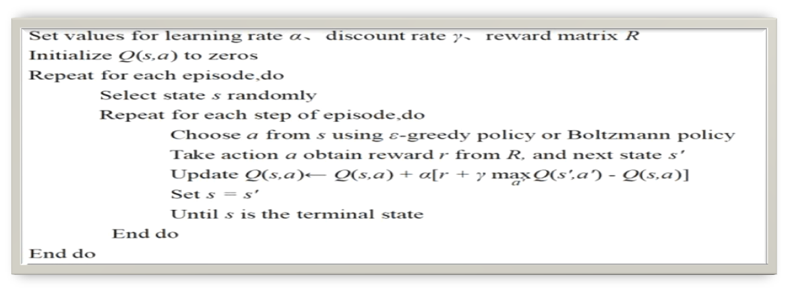
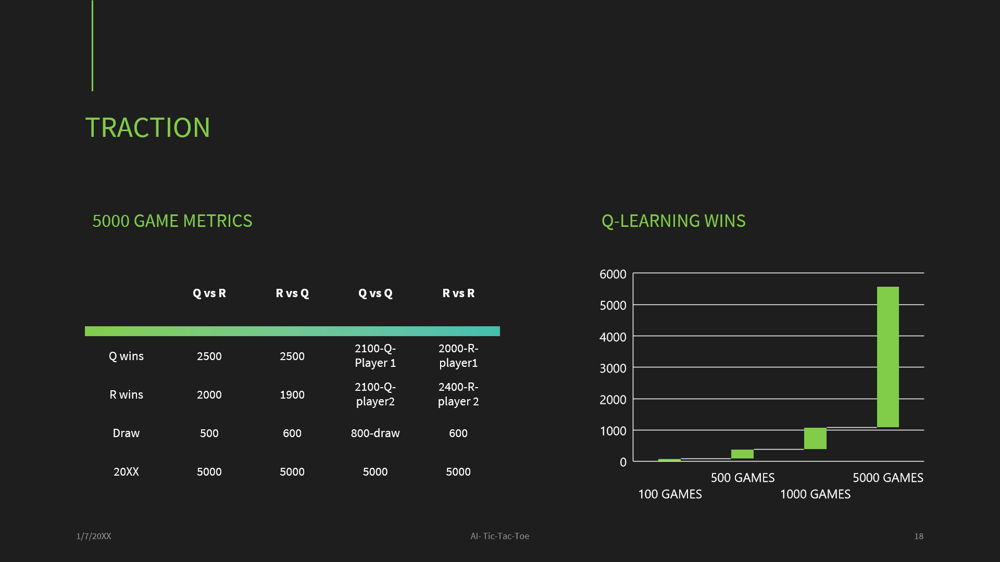

# Implementation-of-reinforcement-strategy-for-tic-tac-toe-player
----Ai-Final term project

----Team Members: Preetam Narendra Soni, Chunwang Yuan (Graduate students at University of New Haven. Pursuing MS, Data Science(Batch-Dec 2022))
# Implementation-of-Tic_Tac_Toe-Agents-using-Different-Learning-Algorithm
Tic-Tac-Toe is a paper-and-pencil game for two players, X and O, who take turns marking the spaces in a 3×3 grid. The player who succeeds in placing three of their marks in a diagonal, horizontal, or vertical row is the winner.
In this project, we intend to develop two agents who will learn how to play tic tac toe and compete again each other. Main objective of the project is to train two agents to learn Q-Learning or Minimax strategy to find which is the best available move strategy.
Implementation of different learning algorithm like Q-learning and  random selection algorithm and comparing them with each other.
This project shall be finished before December 15th, 2021.
Objective: To implement different learning algorithm, observe thier actions after 10000 games and compare
#### Tools and libraries used
* Python 3.6
* Spyder
* PyCharm
* Pandas
* Matplotlib

# Techniques 
 Q-Learning Algorithm
Random Selection Algorithm

# Deliverables
When the project is done, the bunch of files will be generated, as blow:
1)Python Code
2)GitHub Repository: Including the code files above and a usage instruction by README file.
3)YouTube Video: Presenting the ideas and the accomplishment process of this project. 

### Overview
* Used two strategies: (RANDOM and Q-LEARNING) 
* Played 4 format of games: R vs R, R vs Q, Q vs R and Q vs Q
* Played 5,000 games using each strategy. And got the statistics using bar plot to compare the wins for Q-learning over Random and tested them for 5000 games after the game.

## Strategies
#### RANDOM 
* Random strategy selects randomly from available moves and play. 
* This is a very general approach when initiating the game but may give tough time to opponent sometime.
* This approach helps us in making the game fair.

#### Q-LEARNING
* Observation of the environment
* Deciding how to act using some strategy
* Acting accordingly
* Receiving a reward or penalty
* Learning from the experiences and refining our strategy
* Iterate until an optimal strategy is found

## Running code
Instructions on how to run the project:
* **Step 1:** Download the zip file or clone the repository.
* **Step 2:** cd to the directory where your downloaded folder is located.
* **Step 3:** open the project folder in spyder
* **Step 4:** open main.py and run

## Results
#### After 5000 games:
Q –learning defeated Random strategy and had higher edge on all games
#### Q vs Q 
Initiated differently but as soon as they number of games increase, they both had equal wins, loss and draw.
#### Q vs R and  R vs Q
Q was losing when test for 10 games but as games increased to 1000 q learning was on higher side.

====================  

Youtube video link: https://youtu.be/zqlZSSh49i0

